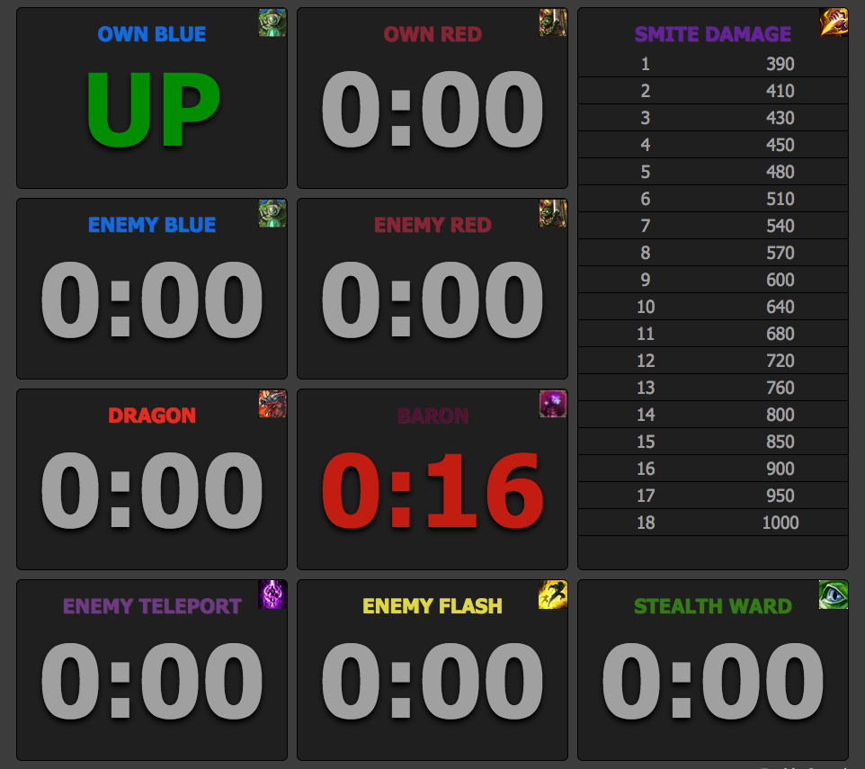

# league-timer

**UPDATE: NO LONGER USEFUL SINCE LEAGUE NOW HAS IN-GAME TIMERS**

A set of timers for League of Legends. It is best run on a multi-monitor setup, with the timers page displayed in your web browser on your second monitor.

[Run Timer](http://dhulihan.github.io/league-timer)

## Credits

* Most of the code is based off of [ertu's jungle timer](http://www.ertu.de/jungle/). This project is a fork.
